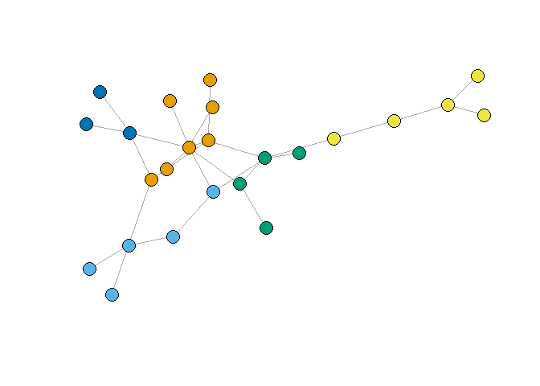

Data Science Intro - Ex. 3
================
Daniel & Liora
December 16, 2017

``` r
library(igraph)
```

    ## Warning: package 'igraph' was built under R version 3.4.3

    ## 
    ## Attaching package: 'igraph'

    ## The following objects are masked from 'package:stats':
    ## 
    ##     decompose, spectrum

    ## The following object is masked from 'package:base':
    ## 
    ##     union

``` r
library(twitteR)
```

    ## Warning: package 'twitteR' was built under R version 3.4.3

``` r
library(httr)
```

    ## Warning: package 'httr' was built under R version 3.4.3

``` r
library(jsonlite)
```

    ## Warning: package 'jsonlite' was built under R version 3.4.3

``` r
library(wordcloud)
```

    ## Warning: package 'wordcloud' was built under R version 3.4.3

    ## Loading required package: RColorBrewer

``` r
library(tm)
```

    ## Warning: package 'tm' was built under R version 3.4.3

    ## Loading required package: NLP

    ## 
    ## Attaching package: 'NLP'

    ## The following object is masked from 'package:httr':
    ## 
    ##     content

``` r
library(base64enc)
```

#### Question 1

Read the csv file and build a graph

``` r
ga.data <- read.csv('ga_edgelist.csv', header = T)
g <- graph.data.frame(ga.data,directed = F)
```

Find the largest connected component

``` r
lcc <- decompose.graph(g)
largest.component <- which.max(sapply(lcc, vcount))
g <- lcc[[largest.component]]
```

##### a.i. Highest centrality by Betweeneness

``` r
btwness <- betweenness(g)
V(g)[which.max(btwness)]
```

    ## + 1/24 vertex, named, from c98821d:
    ## [1] sloan

``` r
max(btwness)
```

    ## [1] 115.3667

##### a.ii. Highest centrality by Closeness

``` r
clsness <- closeness(g) 
V(g)[which.max(clsness)]
```

    ## + 1/24 vertex, named, from c98821d:
    ## [1] torres

``` r
max(clsness)
```

    ## [1] 0.01754386

##### a.iii. Highest centrality by Eigenvector

``` r
egnvec <- graph.eigen(g)$vectors
V(g)[which.max(egnvec)]
```

    ## + 1/24 vertex, named, from c98821d:
    ## [1] torres

``` r
max(egnvec)
```

    ## [1] 0.3609263

#### Question 1 community detection using Girvan-Newman

``` r
gc <-  edge.betweenness.community(g)
gc
```

    ## IGRAPH clustering edge betweenness, groups: 6, mod: 0.47
    ## + groups:
    ##   $`1`
    ##   [1] "lexi"  "sloan" "nancy" "avery"
    ##   
    ##   $`2`
    ##   [1] "owen"    "yang"    "altman"  "colin"   "preston"
    ##   
    ##   $`3`
    ##   [1] "torres"   "o'malley" "arizona"  "olivia"  
    ##   
    ##   $`4`
    ##   + ... omitted several groups/vertices

##### b.i. Plot by colors

``` r
plot(g, vertex.size=7, vertex.label=NA,
     vertex.color=gc$membership, asp=FALSE)
```


##### b.ii. Number of communities and their size

We got 6 communities of the following sizes

``` r
sizes(gc)
```

    ## Community sizes
    ## 1 2 3 4 5 6 
    ## 4 5 4 4 4 3

##### b.iii. Modularity score

``` r
modularity(g, gc$membership)
```

    ## [1] 0.46875

#### Question 1 community detection using fastgreedy

``` r
gc1 <-  fastgreedy.community(g)
gc1
```

    ## IGRAPH clustering fast greedy, groups: 5, mod: 0.48
    ## + groups:
    ##   $`1`
    ##   [1] "torres"       "karev"        "o'malley"     "arizona"     
    ##   [5] "kepner"       "olivia"       "mrs. seabury"
    ##   
    ##   $`2`
    ##   [1] "derek"   "grey"    "addison" "finn"    "steve"  
    ##   
    ##   $`3`
    ##   [1] "lexi"  "sloan" "nancy" "avery"
    ##   
    ##   + ... omitted several groups/vertices

##### b.i. Plot by colors

``` r
plot(g, vertex.size=7, vertex.label=NA,
     vertex.color=gc1$membership, asp=FALSE)
```



##### b.ii. Number of communities and their size

We got 5 communities of the following sizes

``` r
sizes(gc1)
```

    ## Community sizes
    ## 1 2 3 4 5 
    ## 7 5 4 5 3

##### b.iii. Modularity score

``` r
modularity(g, gc1$membership)
```

    ## [1] 0.4789541

#### Question 2

##### a.describe the data gathering and data

We choose the Star Wars tweeter page as our target for data gathering. the new movie "The Last Jedi" has been released this month and there is a lot of activity around it, we decided to read the page's feed and analyze which words appear together across tweets.

``` r
source("twitterOAuth.R")
sig <- setup_twitter_oauth(consumer_key, consumer_secret, access_token, access_secret)
```

    ## [1] "Using direct authentication"

We wanted to get a graph with a lot of edges so instead of reading fewer tweets and build the graph we read a lot of tweets and take the most frequent words.

``` r
timeline <- userTimeline("starwars", n=500)
```

##### b.define vertices and edges

We use frequent words as vertices and edges between words appearing in the same tweet, we also use weights as the number of times a pair appear together. we will use adjancey matrix in order to build the graph.

``` r
timeline.text <- sapply(timeline, function(x) x$getText())
corpus <- Corpus(VectorSource(timeline.text))
corpus <- tm_map(corpus, function(x) iconv(enc2utf8(x), sub = "byte")) 
removeURL <- function(x) gsub("http[[:alnum:]]*", "", x)
corpus <- tm_map(corpus, content_transformer(removeURL))  
skipWords <- function(x) removeWords(x, stopwords("english"))
funcs <- list(tolower, removePunctuation, removeNumbers, stripWhitespace, skipWords)
corpus <- tm_map(corpus, FUN = tm_reduce, tmFuns = funcs)
tdm <- TermDocumentMatrix(corpus)

term.freq = findFreqTerms(tdm, lowfreq = 7)

tdm.freq <- tdm[head(term.freq, 200),]
tdm.freq[tdm.freq > 1] <- 1
tdm.freq <- as.matrix(tdm.freq)

tm <- tdm.freq %*% t(tdm.freq)
```

##### c.create the graph

now we build the graph from the adjacney matrix we created in the previous step

``` r
g2 = graph.adjacency(tm, weighted=T, mode="undirected")
g2 <- simplify(g2)
V(g2)$color <- "orange"
plot(g2, layout=layout.fruchterman.reingold, asp=FALSE)
```


##### d.analyze centrality and detect communities

The graph we recived has only 1 component so we will work on it

###### a.i. Highest centrality by Betweeneness

``` r
btwness <- betweenness(g2)
V(g2)[which.max(btwness)]
```

    ## + 1/36 vertex, named, from cee6728:
    ## [1] new

``` r
max(btwness)
```

    ## [1] 84.96066

###### a.ii. Highest centrality by Closeness

``` r
clsness <- closeness(g2) 
V(g2)[which.max(clsness)]
```

    ## + 1/36 vertex, named, from cee6728:
    ## [1] galaxy

``` r
max(clsness)
```

    ## [1] 0.01449275

###### a.iii. Highest centrality by Eigenvector

``` r
egnvec <- graph.eigen(g2)$vectors
V(g2)[which.max(egnvec)]
```

    ## + 1/36 vertex, named, from cee6728:
    ## [1] upcoming

``` r
max(egnvec)
```

    ## [1] -0.02971649

#### Question 2 community detection using Girvan-Newman

``` r
gc2 <-  edge.betweenness.community(g2)
gc2
```

    ## IGRAPH clustering edge betweenness, groups: 12, mod: 0.094
    ## + groups:
    ##   $`1`
    ##   [1] "director"    "rianjohnson" "thelastjedi" "live"       
    ##   
    ##   $`2`
    ##    [1] "star"      "wars"      "now"       "away"      "don’t"  
    ##    [6] "far"       "galaxy"    "you"       "join"      "know"     
    ##   [11] "halloween"
    ##   
    ##   $`3`
    ##   [1] "new"   "force"
    ##   + ... omitted several groups/vertices

###### b.i. Plot by colors

``` r
plot(g2, vertex.size=7, vertex.label=NA,
     vertex.color=gc2$membership, asp=FALSE)
```


###### b.ii. Number of communities and their size

We got 12 communities of the following sizes

``` r
sizes(gc2)
```

    ## Community sizes
    ##  1  2  3  4  5  6  7  8  9 10 11 12 
    ##  4 11  2  1  8  1  3  1  2  1  1  1

###### b.iii. Modularity score

``` r
modularity(g2, gc2$membership)
```

    ## [1] 0.06994801

#### Question 2 community detection using fastgreedy

``` r
gc2 <-  fastgreedy.community(g2)
gc2
```

    ## IGRAPH clustering fast greedy, groups: 5, mod: 0.22
    ## + groups:
    ##   $`1`
    ##   [1] "star"     "wars"     "new"      "book"     "upcoming" "art"     
    ##   [7] "fan"      "inspired"
    ##   
    ##   $`2`
    ##   [1] "director"    "rianjohnson" "amp"         "live"        "join"       
    ##   
    ##   $`3`
    ##   [1] "away"      "far"       "galaxy"    "you"       "know"     
    ##   [6] "halloween"
    ##   + ... omitted several groups/vertices

###### b.i. Plot by colors

``` r
plot(g2, vertex.size=7, vertex.label=NA,
     vertex.color=gc2$membership, asp=FALSE)
```


###### b.ii. Number of communities and their size

We got 5 communities of the following sizes

``` r
sizes(gc2)
```

    ## Community sizes
    ##  1  2  3  4  5 
    ##  8  5  6  7 10

###### b.iii. Modularity score

``` r
modularity(g2, gc2$membership)
```

    ## [1] 0.1541377
